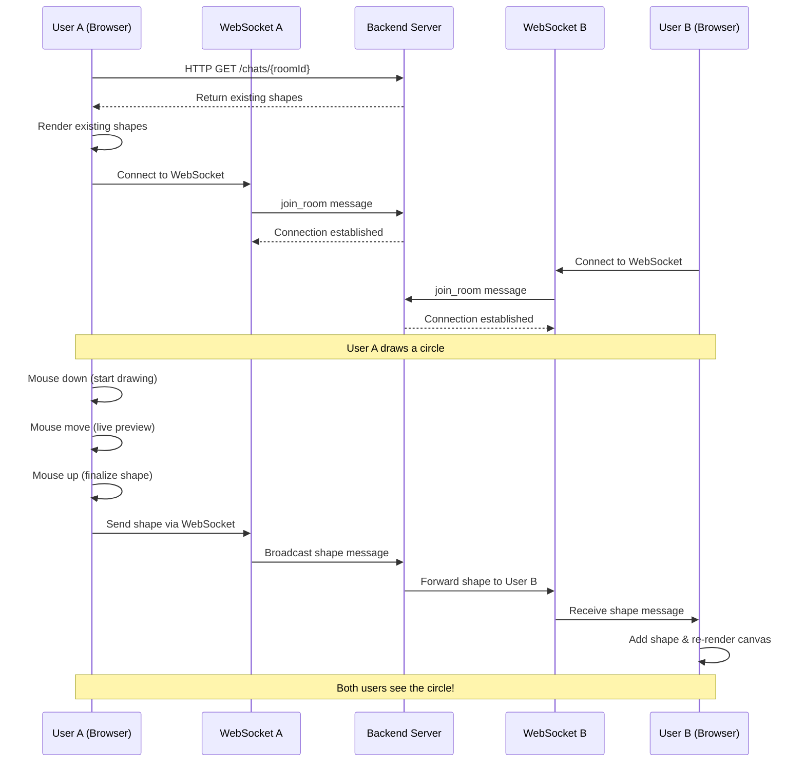

# 🎨 Excelidraw - Collaborative Whiteboard Application

A real-time collaborative whiteboard application built with Next.js, WebSocket, and HTML Canvas. Draw shapes together with your team in real-time with instant synchronization.


## ✨ Features

- 🖊️ **Real-time Drawing** - Draw rectangles and circles with live preview
- 👥 **Multi-user Collaboration** - Multiple users can draw on the same canvas simultaneously
- 🔄 **Instant Synchronization** - All changes are broadcast to connected users in real-time
- 💾 **Persistent Storage** - Drawings are saved and loaded when rejoining a room
- ���� **Multiple Tools** - Support for circle, rectangle, and pencil tools
- 🚀 **No Sign-up Required** - Jump straight into drawing (auth UI placeholder)

## 📁 Project Structure

```
week-22-excelidraw/
├── apps/
│   └── excelidraw-frontend/
│       ├── app/                          # Next.js App Router
│       │   ├── page.tsx                  # Landing page with hero section
│       │   ├── layout.tsx                # Root layout with fonts
│       │   ├── globals.css               # Global styles and theme variables
│       │   ├── signin/
│       │   │   └── page.tsx              # Sign-in page (placeholder)
│       │   ├── signup/
│       │   │   └── page.tsx              # Sign-up page (placeholder)
│       │   └── canvas/
│       │       └── [roomId]/
│       │           └── page.tsx          # Dynamic canvas room page
│       │
│       ├── components/                   # React Components
│       │   ├── Canvas.tsx                # Main canvas component with toolbar
│       │   ├── RoomCanvas.tsx            # WebSocket connection wrapper
│       │   ├── AuthPage.tsx              # Authentication UI component
│       │   └── IconButton.tsx            # Reusable toolbar button
│       │
│       ├── draw/                         # Drawing Logic
│       │   ├── Game.ts                   # Core Game class - manages canvas state
│       │   ├── http.ts                   # HTTP API calls to backend
│       │   └── index.ts                  # Legacy drawing functions
│       │
│       ├── config.ts                     # Backend URLs configuration
│       ├── package.json                  # Dependencies
│       └── tsconfig.json                 # TypeScript configuration
│
└── packages/                             # Shared packages (UI components, etc.)
```

### 🗂️ Key Files Explained

| File | Purpose |
|------|---------|
| `app/canvas/[roomId]/page.tsx` | Dynamic route for canvas rooms |
| `components/Canvas.tsx` | Manages Game instance and toolbar UI |
| `components/RoomCanvas.tsx` | Handles WebSocket connection setup |
| `draw/Game.ts` | Core class containing all drawing logic and state |
| `draw/http.ts` | Fetches existing shapes from backend |
| `config.ts` | Backend API and WebSocket URLs |

## 🔄 Real-time Collaboration Flow



### 📡 WebSocket Message Format

**Joining a Room:**
```json
{
  "type": "join_room",
  "roomId": "room-123"
}
```

**Broadcasting a Shape:**
```json
{
  "type": "chat",
  "roomId": "room-123",
  "message": "{\"shape\":{\"type\":\"circle\",\"centerX\":200,\"centerY\":150,\"radius\":50}}"
}
```

## 📊 Data Flow Diagram

```
┌─────────────────────────────────────────────────────────────┐
│                     USER JOURNEY                            │
└─────────────────────────────────────────────────────────────┘

1️⃣ User Navigation
   ┌──────────────┐
   │   Browser    │
   │  /canvas/123 │
   └──────┬───────┘
          │
          ▼
   ┌──────────────────┐
   │  CanvasPage      │
   │  (Next.js Route) │
   └──────┬───────────┘
          │
          ▼
   ┌──────────────────┐
   │  RoomCanvas      │
   │  Component       │
   └──────┬───────────┘
          │
          ├─────────────────────���
          │                     │
          ▼                     ▼
   ┌─────────────┐      ┌──────────────┐
   │  WebSocket  │      │   Canvas     │
   │ Connection  │      │  Component   │
   └─────────────┘      └──────┬───────┘
                               │
                               ▼
                        ┌──────────────┐
                        │  Game Class  │
                        │  Instance    │
                        └──────────────┘

2️⃣ Game Initialization Flow
   ┌─────────────────────────────────────────────────────┐
   │            Game Constructor                         │
   │  ┌─────────────────────────────────────────────┐   │
   │  │  1. Initialize Canvas Context               │   │
   │  │  2. Set up state variables                  │   │
   │  │  3. Call init()                             │   │
   │  │  4. Call initHandlers()                     │   │
   │  │  5. Call initMouseHandlers()                │   │
   │  └─────────────────────────────────────────────┘   │
   └─────────────────────────────────────────────────────┘
          │              │              │
          ▼              ▼              ▼
   ┌──────────┐  ┌─────────────┐  ┌──────────────┐
   │  init()  │  │initHandlers()│  │initMouse     │
   │          │  │             │  │Handlers()    │
   └────┬─────┘  └──────┬──────┘  └──────┬───────┘
        │               │                 │
        ▼               ▼                 ▼
   ┌──────────┐  ┌─────────────┐  ┌──────────────┐
   │ HTTP GET │  │  WebSocket  │  │  Mouse Event │
   │ existing │  │   onmessage │  │  Listeners   │
   │  shapes  │  │   handler   │  │  (down, up,  │
   └────┬─────┘  └──────┬──────┘  │   move)      │
        │               │          └──────┬───────┘
        ▼               │                 │
   ┌──────────┐         │                 │
   │ Render   │         │                 │
   │ shapes   │         │                 │
   └──────────┘         │                 │
                        │                 │

3️⃣ Drawing Interaction Flow
   ┌─────────────────────────────────────────────────────┐
   │              USER DRAWS A SHAPE                     │
   └─────────────────────────────────────────────────────┘
   
   Mouse Down           Mouse Move              Mouse Up
   ─────────────────────────────────────────────────────▶
        │                   │                       │
        ▼                   ▼                       ▼
   ┌─────────┐      ┌──────────────┐      ┌───────────────┐
   │ Record  │      │ Live Preview │      │ Create Shape  │
   │ start   │      │ Clear canvas │      │ Object        │
   │ position│      │ Redraw all   │      └───────┬───────┘
   └─────────┘      │ existing     │              │
                    │ shapes       │              ▼
                    │ Draw preview │      ┌───────────────┐
                    └──────────────┘      │ Add to local  │
                                          │ shapes array  │
                                          └───────┬───────┘
                                                  │
                                                  ▼
                                          ┌───────────────┐
                                          │ Send via      │
                                          │ WebSocket     │
                                          └───────┬───────┘
                                                  │
                                                  ▼
                                          ┌───────────────┐
                                          │   Backend     │
                                          └───────┬───────┘
                                                  │
                        ┌─────────────────────────┴────────────────────┐
                        │                                              │
                        ▼                                              ▼
                ┌───────────────┐                              ┌──────────────┐
                │  User A       │                              │  User B      │
                │  (sender)     │                              │  (receiver)  │
                │  Re-renders   │                              │  Receives    │
                │  canvas       │                              │  message     │
                └──────���────────┘                              └──────┬───────┘
                                                                      │
                                                                      ▼
                                                              ┌──────────────┐
                                                              │ Add shape to │
                                                              │ local array  │
                                                              └──────┬───────┘
                                                                      │
                                                                      ▼
                                                              ┌──────────────┐
                                                              │ Re-render    │
                                                              │ canvas       │
                                                              └──────────────┘

4️⃣ Rendering Pipeline
   ┌─────────────────────────────────────────────────────┐
   │           clearCanvas() Function                    │
   └─────────────────────────────────────────────────────┘
          │
          ├─────▶ 1. Clear entire canvas
          │
          ├─────▶ 2. Draw black background
          │
          ├─────▶ 3. Loop through existingShapes[]
          │          │
          │          ├─── Rectangle? → ctx.strokeRect()
          │          │
          │          └─── Circle? → ctx.arc()
          │
          └─────▶ 4. Canvas updated ✓
```

## 🚀 Getting Started

### Prerequisites

- Node.js 18+ 
- npm or pnpm
- Backend server running (for WebSocket and HTTP API)

### Installation

1. **Clone the repository:**
   ```bash
   git clone https://github.com/100xdevs-cohort-3/week-22-excelidraw.git
   cd week-22-excelidraw
   ```

2. **Install dependencies:**
   ```bash
   cd apps/excelidraw-frontend
   npm install
   ```

3. **Configure backend URLs:**
   
   Edit `config.ts`:
   ```typescript
   export const WS_URL = "ws://localhost:8080"; // Your WebSocket server
   export const HTTP_BACKEND = "http://localhost:3001"; // Your HTTP API
   ```

4. **Run the development server:**
   ```bash
   npm run dev
   ```

5. **Open your browser:**
   ```
   http://localhost:3000
   ```

6. **Start drawing:**
   - Navigate to `/canvas/room-123` (or any room ID)
   - Select a tool (circle/rectangle)
   - Click and drag to draw
   - Open the same URL in another browser window to see real-time collaboration!

## 🎮 Usage

### Creating a Drawing Room

Navigate to any room by changing the URL:
```
http://localhost:3000/canvas/your-room-name
```

Multiple users visiting the same room URL can collaborate in real-time.

### Drawing Tools

- **Circle** 🟢 - Click and drag to create circles
- **Rectangle** ⬜ - Click and drag to create rectangles  
- **Pencil** ✏️ - (Planned) Freehand drawing

### Keyboard Shortcuts

Currently no keyboard shortcuts implemented. Contributions welcome!

## 🏗️ Architecture

### Game Class (`draw/Game.ts`)

The core of the application is the `Game` class which manages:

- **Canvas State** - Drawing context and shape storage
- **WebSocket Communication** - Real-time message handling
- **Mouse Events** - User interaction tracking
- **Rendering** - Canvas update logic

**Key Methods:**

| Method | Purpose |
|--------|---------|
| `init()` | Fetches and renders existing shapes from backend |
| `initHandlers()` | Sets up WebSocket message listeners |
| `initMouseHandlers()` | Attaches mouse event listeners for drawing |
| `clearCanvas()` | Renders all shapes on the canvas |
| `setTool()` | Changes the active drawing tool |
| `destroy()` | Cleanup method to remove event listeners |

### Shape Types

```typescript
type Shape = 
  | { type: "rect"; x: number; y: number; width: number; height: number }
  | { type: "circle"; centerX: number; centerY: number; radius: number }
  | { type: "pencil"; startX: number; startY: number; endX: number; endY: number }
```

## 🔧 Tech Stack

### Frontend
- **Next.js 14** - React framework with App Router
- **TypeScript** - Type safety
- **HTML Canvas API** - Drawing functionality
- **WebSocket** - Real-time communication
- **Tailwind CSS** - Styling
- **Axios** - HTTP requests
- **Lucide Icons** - UI icons

### Backend (Not included in this repo)
- WebSocket server for real-time messaging
- HTTP API for persistent storage
- Database for storing shapes

## 📝 API Reference

### HTTP Endpoints

#### Get Room Shapes
```http
GET /chats/{roomId}
```

**Response:**
```json
{
  "messages": [
    {
      "message": "{\"shape\":{\"type\":\"circle\",\"centerX\":200,\"centerY\":150,\"radius\":50}}"
    }
  ]
}
```

### WebSocket Events

#### Join Room
```javascript
socket.send(JSON.stringify({
  type: "join_room",
  roomId: "room-123"
}))
```

#### Send Shape
```javascript
socket.send(JSON.stringify({
  type: "chat",
  roomId: "room-123",
  message: JSON.stringify({
    shape: {
      type: "circle",
      centerX: 200,
      centerY: 150,
      radius: 50
    }
  })
}))
```

## 🤝 Contributing

Contributions are welcome! Here are some areas that need work:

- [ ] Implement pencil/freehand drawing tool
- [ ] Add color picker
- [ ] Implement undo/redo functionality
- [ ] Add user authentication
- [ ] Show active users in room
- [ ] Export canvas as PNG/SVG
- [ ] Add keyboard shortcuts
- [ ] Implement eraser tool
- [ ] Add text tool
- [ ] Improve mobile responsiveness

### Development Workflow

1. Fork the repository
2. Create a feature branch (`git checkout -b feature/amazing-feature`)
3. Commit your changes (`git commit -m 'Add amazing feature'`)
4. Push to the branch (`git push origin feature/amazing-feature`)
5. Open a Pull Request

## 🐛 Known Issues

- Authentication pages are placeholders (not functional)
- Pencil tool is defined but not fully implemented
- No error handling for WebSocket disconnections
- Mouse coordinates don't account for canvas scroll position
- No mobile touch support

## 📄 License

This project is part of the 100xDevs Cohort 3 curriculum.

## 🙏 Acknowledgments

- Built as part of **100xDevs Cohort 3** by Harkirat Singh
- Inspired by Excalidraw
- Canvas API documentation from MDN

## 📞 Support

For questions or issues, please open an issue on GitHub.

---

**Happy Drawing! 🎨✨**

Made with ❤️ by the 100xDevs community
